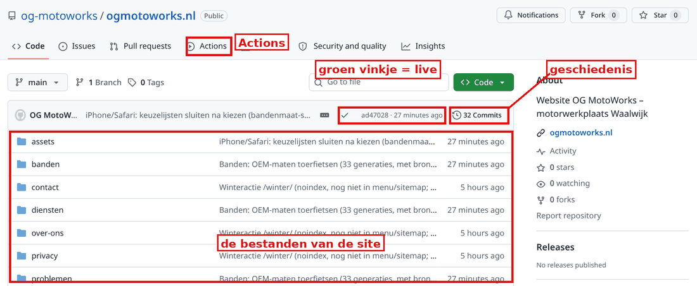
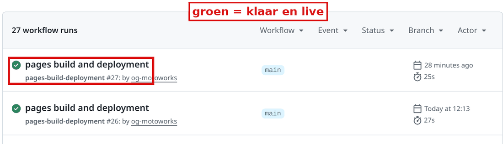
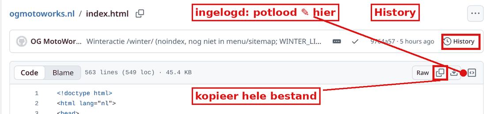
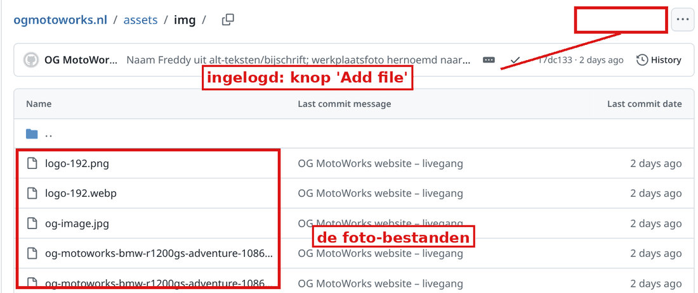
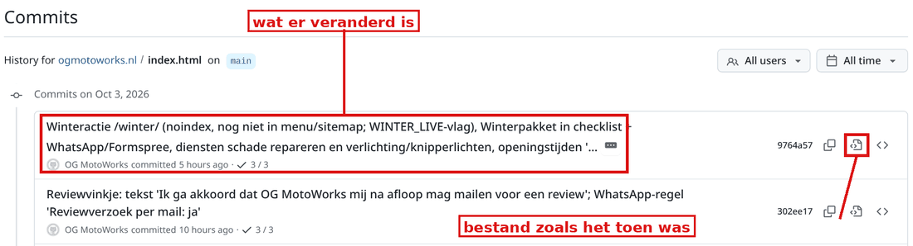
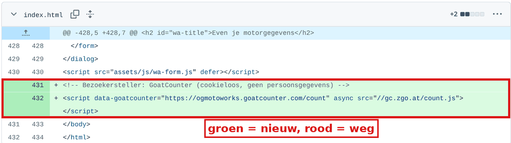

# Zelf je website beheren

**Korte cursus voor Freddy en Sven – OG MotoWorks, Waalwijk**  
Stand: 3 oktober 2026. Website: [ogmotoworks.nl](https://ogmotoworks.nl)

Deze cursus is voor jullie. Je hoeft niets van websites te weten. Lees eerst deel 1 en 2. Doe daarna de oefeningen.

> **Belangrijk vooraf:** de website wordt ook bijgewerkt door de Webmaster-bot. Veel pagina's maakt die bot met een programma op zijn eigen computer. Verander je zelf iets? Meld het dan altijd (zie deel 6). Anders kan de bot jouw wijziging later weer overschrijven.

## 1. Hoe werkt het?

De website bestaat uit drie onderdelen:

| Onderdeel | Wat is het? | Vergelijk het met |
|---|---|---|
| **GitHub** | De map met alle bestanden van de site: teksten, foto's, opmaak. Adres: github.com/og-motoworks/ogmotoworks.nl | De archiefkast |
| **GitHub Pages** | Zet die bestanden gratis online. | De etalage |
| **TransIP** | Daar staat het adres ogmotoworks.nl. Het adres wijst naar GitHub Pages. | Het bord aan de gevel |

**Wat gebeurt er als je iets opslaat?**

1. Je past op GitHub een bestand aan.
2. Je klikt op **Commit changes**. "Commit" betekent: opslaan, met een kort briefje erbij.
3. GitHub Pages zet de nieuwe versie online. Dat duurt ongeveer 30 seconden.
4. Na ongeveer **1 minuut** zie je het op ogmotoworks.nl. Zie je het niet? Ververs de pagina met **Ctrl + F5** (Mac: Cmd + Shift + R).

Of het gelukt is, zie je op twee plekken:

- Op de beginpagina van GitHub, naast de laatste wijziging: **groen vinkje** = live. **Geel bolletje** = nog bezig. **Rood kruisje** = mislukt.
- In het tabblad **Actions**: daar staat elke keer dat de site online gezet is.

Elke wijziging wordt bewaard. Je kunt dus altijd terug naar een oude versie (oefening 5).

## 2. Kaart: waar staat wat?

Elke pagina is een bestand. De homepage is `index.html`. Een andere pagina is een map met daarin `index.html`.

| Pagina | Bestand | Zelf aanpassen? |
|---|---|---|
| Homepage | `index.html` | **Ja**, de inhoud: teksten, prijzenblok, reviews, "Over ons", contactblok. **Niet** het menu, de voettekst en het blok "Zo werken wij": die maakt de bot. |
| Diensten, Banden, Tarieven, Contact, Over ons, Werk, Problemen, Privacy, Winter | bv. `tarieven/index.html`, `diensten/kettingset/index.html` | **Liever niet.** Deze pagina's maakt de bot. Een wijziging blijft alleen staan als je het meldt (deel 6). Makkelijker: vraag het aan je bot. |

**Waar vind je wat?**

- **Openingstijden** (nu: "Op afspraak: ma-vr 19-23, za-zo 10-23"): in `index.html` in het contactblok (zoek `Open`), in de voettekst (zoek `footer__hours`) en bovenin voor Google (zoek `opens`). Op alle andere pagina's zet de bot ze in de voettekst.
- **Prijzen**: op de homepage in het blok "Duidelijke prijzen" (`index.html`, zoek `€`). De tarievenpagina staat in `tarieven/index.html` en is van de bot. Ook de dienstpagina's noemen prijzen.
- **Teksten**: homepage in `index.html`. Andere pagina's: via de bot.
- **Foto's**: map `assets/img/`. Elke foto staat er 4 keer in (2 maten, als .jpg en als .webp).
- **Bandenprijzen en bandenlijst**: `assets/data/banden.json` en `banden-assortiment.json`. **Niet met de hand.** Elke maand op de **5e** zet de bot nieuwe bandenprijzen. Wat je zelf verandert, is dan weg.
- **Motorlijst** (merken, modellen): `assets/data/motoren.json`. **Niet met de hand**, de bot maakt dit bestand.
- **Onderhoudsintervallen**: `assets/data/onderhoud.json`. Laat dit aan de bot over.

## 3. Vijf oefeningen

**Zo pas je altijd een bestand aan:**

1. Ga naar **github.com** en log in als **og-motoworks**. (Sven: later met je eigen account, zie deel 5.)
2. Open **og-motoworks/ogmotoworks.nl**.
3. Klik op het bestand, bijvoorbeeld `index.html`.
4. Klik rechtsboven op het **potlood** ✎ ("Edit this file").
5. Zoek je tekst: klik in het bestand en druk **Ctrl + F** (Mac: Cmd + F).
6. Verander alleen de gewone tekst tussen `>` en `<`. Laat alle tekens zoals `
`, `"` en `/` staan.
7. Klik rechtsboven op de groene knop **Commit changes…**
8. Schrijf in het vak een kort briefje, bv. "Openingstijden aangepast".
9. Laat **Commit directly to the main branch** aangevinkt. Klik op **Commit changes**.
10. Wacht 1 minuut. Kijk of het vinkje groen is. Bekijk de site. Meld het daarna (deel 6).

**Oefening 1 – Tekst aanpassen.** Open `index.html`. Zoek `Stuur ons een appje en we plannen`. Dit is de zin onder de grote kop op de homepage. Verander de zin. Sla op (stap 7-10).

**Oefening 2 – Openingstijden wijzigen.** Open `index.html`. Zoek `Op afspraak`. Je vindt het **twee keer**: in het contactblok en in de voettekst. Pas beide aan. Zoek daarna `opens`: verander daar alleen de tijden, bv. `"19:00"`. Sla op. Let op: de andere pagina's en de voettekst maakt de bot. Meld de nieuwe tijden dus aan je bot. Dan past de Webmaster ze overal aan.

**Oefening 3 – Een prijs wijzigen.** Open `index.html`. Zoek `Kettingset vervangen`. In dezelfde regel staat `€150`. Verander alleen het getal. Sla op. De prijs staat ook op de tarievenpagina, op de dienstpagina en in het aanvraagformulier. Die past de Webmaster aan als je het meldt. Bandenmontage veranderen? Vraag dat aan je bot. Die prijs wordt ook gebruikt in het bandenmenu. Het uurtarief staat op veel pagina's. Ook dat gaat het best via je bot.

**Oefening 4 – Een foto vervangen.** Elke foto staat er 4 keer, bv.:
`og-motoworks-bmw-r1200gs-adventure-640.jpg`, `…-640.webp`, `…-1086.jpg` en `…-1086.webp`.
Het getal is de breedte in pixels. Telefoons laden meestal de .webp.

1. Maak van je nieuwe foto 4 bestanden met de gratis site **squoosh.app**: 2 breedtes (zoals in de naam), elk als JPG en als WebP.
2. Geef ze **precies dezelfde naam** als de oude bestanden.
3. Houd dezelfde vorm: staand blijft staand. Anders wordt de foto anders bijgesneden.
4. Houd elk bestand onder de **300 KB**. Dan blijft de site snel.
5. Open de map `assets/img`. Klik op **Add file** → **Upload files**. Sleep de 4 bestanden erin.
6. Klik op **Commit changes**. Bestanden met dezelfde naam worden vervangen.

Lukt dit niet? Stuur de foto naar je bot. De Webmaster maakt dan de 4 versies.

**Oefening 5 – Een wijziging terugdraaien.** De GitHub-website heeft geen knop "ongedaan maken" voor een gewone opslag. (Een knop **Revert** bestaat alleen bij een "pull request". Die gebruiken jullie niet.) Je zet de oude versie dus zelf terug:

1. Open het bestand en klik op **History**. Je ziet alle wijzigingen, de nieuwste bovenaan.
2. Controleer: staat **jouw** wijziging bovenaan? Zo niet, dan heeft de bot daarna iets veranderd. Stop dan en vraag het aan je bot. Anders maak je ook zijn werk ongedaan.
3. Kijk naar de regel **onder** jouw wijziging. Dat is de versie van vóór jouw wijziging.
4. Klik in die regel op het icoon **"View code at this point"** (bestand zoals het toen was).
5. Klik op het icoon **kopieer hele bestand** ("Copy raw file").
6. Open het bestand opnieuw, nu de gewone versie. Klik op het potlood ✎.
7. Klik in het bestand. Druk **Ctrl + A** (alles kiezen) en dan **Ctrl + V** (plakken).
8. **Commit changes** met als briefje: "Terugdraaien: …". Meld het aan je bot.

Bij een foto gaat het net zo. In stap 5 klik je op **Download**. Daarna upload je het oude bestand weer (oefening 4).

Klik je op een briefje in History, dan zie je precies wat er veranderd is:

## 4. Niet aanraken

| Niet aanraken | Waarom |
|---|---|
| Bestand `CNAME` | Hierin staat ogmotoworks.nl. Zonder dit bestand is de site onbereikbaar op dat adres. |
| Bestand `.nojekyll` | Zorgt dat GitHub de bestanden gewoon online zet. |
| Map `assets/js/` (scripts) | Het formulier, het bandenmenu en de motorkeuze. Eén fout teken en het werkt niet meer. |
| Map `assets/data/` (JSON-bestanden) | Banden, prijzen, motoren. Maakt de bot. |
| `sitemap.xml`, `robots.txt`, `assets/css/` | Voor Google en de opmaak. Maakt of beheert de bot. |
| Map `.github/` | Bestaat nu niet. Maak hem ook niet aan. |
| GitHub **Settings → Pages** | Daar staat de koppeling met ogmotoworks.nl en HTTPS. |
| Bij TransIP: de **DNS-instellingen** (A-records en CNAME) | Die laten het adres naar GitHub wijzen. Fout = site weg. |
| Het **GoatCounter-stukje** onderaan elke pagina (`data-goatcounter`) | Dat telt de bezoekers. |

**Lijkt de site stuk?**

1. **Geen paniek.** Er gaat niets verloren. Alles staat in de History.
2. Wacht 2 minuten en ververs met **Ctrl + F5**.
3. Kijk bij **Actions**. Rood kruisje? Dan is het online zetten mislukt. Kijk ook op **githubstatus.com** of GitHub zelf een storing heeft.
4. Kwam het door jouw laatste wijziging? Draai die terug (oefening 5).
5. Stuur je bot een bericht: wat je zag, sinds wanneer en wat je het laatst hebt veranderd.

## 5. Eigenaarschap: checklist

**Hoe het nu is (3 oktober 2026):**

- Er is **geen GitHub-organisatie**. `og-motoworks` is een gewoon (persoonlijk) GitHub-account. Wie kan inloggen op dat account, is eigenaar.
- Alleen dit account heeft toegang. Er zijn geen andere leden of uitnodigingen. Sven heeft nog geen eigen toegang.
- De bots gebruiken hetzelfde account.
- Het account hangt aan het Gmail-adres van Freddy. Daarmee kun je het wachtwoord opnieuw instellen.
- De bots kunnen niet zien of tweestapsverificatie (2FA) aanstaat. Controleer dat zelf.
- Het domein staat bij TransIP. De bots weten niet op welk TransIP-account. Controleer dat ook zelf.

**Checklist**

- [ ] Freddy kan zelf inloggen op github.com als og-motoworks. Wachtwoord vergeten? Gebruik "Forgot password" met je Gmail.
- [ ] 2FA staat aan op GitHub: Settings → Password and authentication.
- [ ] De **recovery codes** van GitHub zijn gedownload. Bewaar ze op papier op een veilige plek en in je wachtwoordmanager.
- [ ] Je Gmail-account heeft ook 2FA. Met dat mailadres kun je GitHub terugkrijgen.
- [ ] Freddy kan inloggen bij **TransIP** en ziet daar ogmotoworks.nl. Het domein staat op naam van OG MotoWorks of Freddy.
- [ ] 2FA staat aan bij TransIP. De recovery codes zijn veilig bewaard.
- [ ] Freddy en Sven gebruiken allebei een **wachtwoordmanager**, bv. Bitwarden (gratis) of 1Password.
- [ ] Sven krijgt toegang. Simpel: Sven maakt een eigen GitHub-account en Freddy voegt hem toe bij Settings → Collaborators. Willen jullie allebei "Owner" zijn? Dan is er een organisatie nodig. Vraag dat aan je bot en doe het **niet zelf**. De site verhuist dan mee, en bij TransIP moet een instelling (de CNAME van www) worden aangepast.

## 6. Laat de bots weten wat je zelf veranderd hebt

De Webmaster-bot maakt de meeste pagina's opnieuw met zijn eigen bouwbestanden. Weet hij niets van jouw wijziging? Dan kan hij die bij de volgende update overschrijven. Daarom meld je **elke** wijziging, op dezelfde dag.

**Via wie?** Iedereen via zijn eigen hoofdbot:

- **Freddy** → **OG Command**
- **Sven** → **Sven Command**. Die stuurt het door naar OG Command met "Van Sven:" ervoor.

OG Command geeft het door aan de Webmaster. De Webmaster neemt jouw wijziging over in zijn bouwbestanden.

### Wat zet je in je bericht?

> Ik heb zelf de website aangepast.  
> **Wat:** openingstijden veranderd naar …  
> **Pagina/bestand:** homepage, `index.html`  
> **Wanneer:** zaterdag 3 oktober, 15:10  
> **Link:** (link naar de wijziging)  
> Wil je dit overnemen, zodat het niet wordt overschreven?

**De link vind je zo:** open History, klik op het briefje van jouw wijziging en kopieer het adres uit de adresbalk.

**Extra beveiliging:** vóór elke update controleert de Webmaster nu of er op GitHub wijzigingen zijn die niet van een bot komen. Vindt hij er één, dan stopt hij en vraagt hij het eerst aan OG Command. Meld het toch altijd zelf. Dan weet de bot ook wat je bedoelde.

**Tip:** wil je iets veranderen op een pagina van de bot (tarieven, diensten, banden)? Vraag het dan gewoon aan je bot. Dat is sneller en veiliger.
